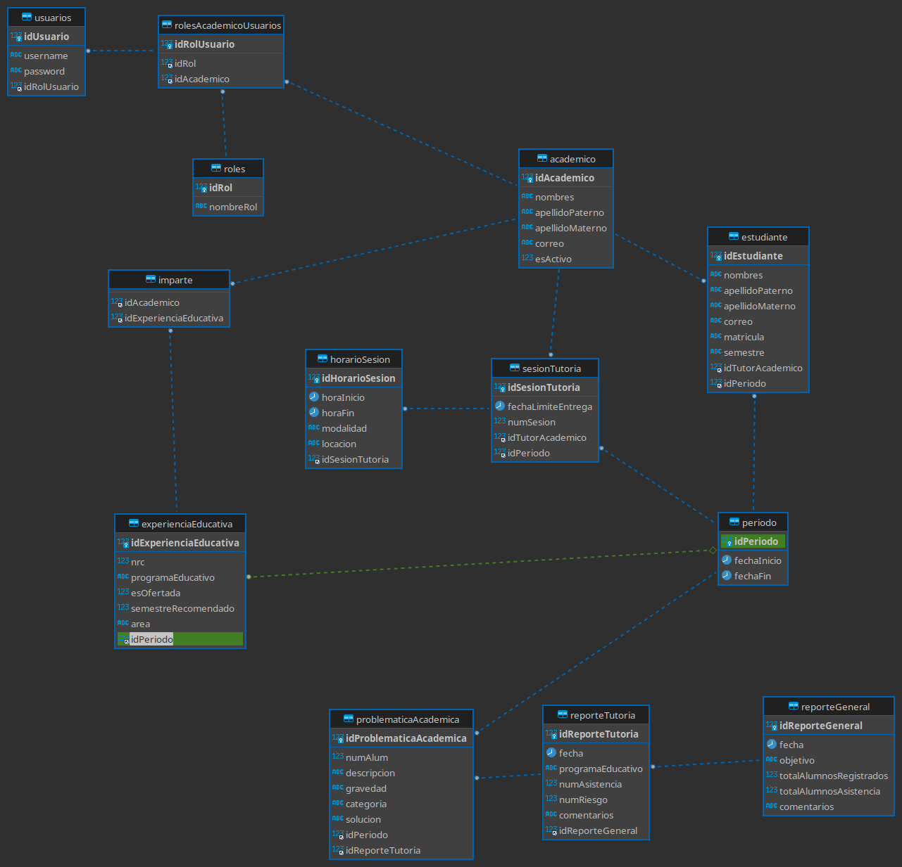

# Data Base

La base de datos implementada para la construcción del **_Sistema De Gestion De Tutorias_** se alojó de forma remota en los servicios de azure, esto con el objetivo de tener un desarrollo e implementacion del sistema preparada para cambios o actualizaciones, a si mismo, la desicion fue tomada para el trabajo remoto en el desarrollo del proyecto y la portabilidad completa del sistema a cualquier sistema operativo.

## Constraints
La principal restricción son 30 días de servicio gratuito en azure, eso con las licencias y descuentos que Microsoft ofrece a los estudiantes de la [Universidad Veracruzana](https://www.uv.mx/fei/).

Los datos para conexión a la base de datos alojado en el servidor de azure, se encuentra en en el archivo [dbconfig.txt](https://github.com/JosepHyv/ProyectoConstruccion/blob/main/ProyectoConstruccion/src/proyectoconstruccion/modelo/dbconfig.txt).

## Structure and implementation
La **estructura** de la base de datos puede consultarse en la siguiente imagen. 

la **implementación** fue realizada en la MySQL Ver 8.0.29 y MariaDB Ver 5.0, posteriormente el despliegue del servidor fue mediante la shell que Azure ofrece y git en la versión 2.35, dicho servidor fue desplegado en un contenedor corriendo linux con el kernel 4.8.

El **Script.sql** utilizado para la implementación se encuentra en esta misma pagina, documentado en el [tutoriasFei-script.sql]()
